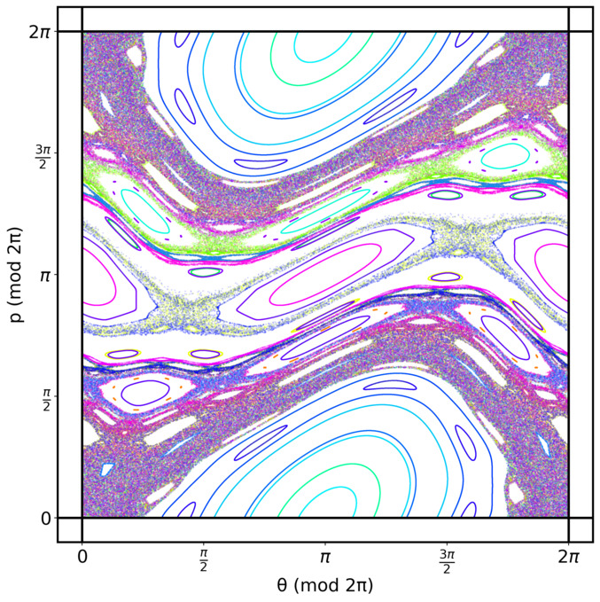
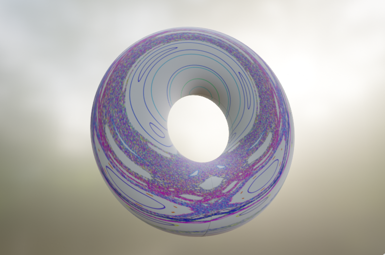

# Kicked-Rotor-Analysis
The kicked rotor is a prototypical model in the field of classical and quantum chaos theory. This code was part of the analysis for my master's thesis, as well as for this paper we published on the topic: https://doi.org/10.1063/5.0084028

The code is split in two parts, one part for the classical kicked rotor, and one part for the quantum kicked rotor. 

This is an example of a phase space diagram, generated by the code in the classical kicked rotor section, for K = 1

This is that same phase space diagram, wrapped into a torus (made in Blender)

